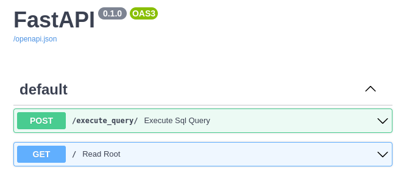

# consulta_academica


**consulta_academica** is a project to build the foundations for data analysis and data features within [UENF][uenf_url]'s Academic System ("[Acadêmico][academico_url]").


## About
[Acadêmico][academico_url] is the system that manages the academic activities of the Universidade Estadual do Norte Fluminense (UENF), such as courses, subjects, enrollments, grades, etc. However, the production database of Academico is not suitable for data analysis and data features, as it contains sensitive and irrelevant data that may compromise the privacy and performance of the system. Therefore, **consulta_academica** was created to address this issue. Our main goal is to build an anonymized and abstracted database that will allow easy development of data routines and features contributing to a data driven culture in our university. 

This project consists of a docker compose orchestration to be run alongside the "[Acadêmico][academico_url]". This system [keeps](#message-broker) the `academico_db`, an internal copy of the appropriate cohort of the "[Acadêmico][academico_url]" production database. From `academico_db` the system [builds](#sql-scripts) the `consulta` schema with tables that refine and simplify the tables in "Academico" production database. The tables in `consulta` can be easily accessed through the [api](#api). 

## Setup
**consulta_academica** is intented to run internally alongside the "[Acadêmico][academico_url]", but you can run it locally following this instructions:

1. Clone the repository: 
        ```git clone```
2. Build the compose: 
        ```docker compose build```
3. Running the services 
        ```docker compose up```

- You can stop the services with:
        ```docker compose down```

## Use

### API
Access the **consulta_academica** API at port 80. You'll be greeted with a json presenting the instructions, an example and the current schema of the **consulta_academica** database:

```json
{"Saudações!":"API Consulta Acadêmica",

"Instruções":"consulte o banco de dados enviando a sua query por meio de um POST para \"/execute_query\"",

"exemplo de query:":"SELECT disciplina_id, contagem_alunos FROM demanda.contagem_aluno_por_disciplina;",

"tabelas no formato {schema/: [tabelas]}":

    {"consulta":["aluno","disciplina_matriz","disciplina","inscricao","turma","plano","disciplina_isencao","disciplina_equivalencia_a_pedido","participacao","atividade","aproveitamento_de_atividade","equivalencia","disciplina_aproveitamento_interno","disciplina_inscricao","disciplina_participacao","disciplina_cursada_ou_aproveitada","disciplina_cursada_aproveitada_ou_equivalente","disciplina_cursada","pre_requisito","co_resuisito"],

    "demanda":["disciplina_aprovada","disciplina_remanescente","disciplina_demandada","contagem_aluno_por_disciplina"]}}
```

#### example query: "SELECT * FROM consulta.aluno;"
```bash
curl -X 'POST' \
  'http://localhost/execute_query/?query=SELECT%20%2A%20FROM%20consulta.aluno%3B' \
  -H 'accept: application/json' \
  -d ''
```

```json
{"columns":["id","curso_id","matriz_id"],"data":[[1,1,1],[2,1,1],[3,1,1],[4,2,2],[5,2,2]]}
```

#### /docs
You can also access the auto generated documentation at `/docs`


## Message broker 
**consulta_academica** has a RabbitMQ and python services to consume the queues at port 5672.
Currently `data_to_db` is a queue to receive tuples from the "[Acadêmico][academico_url]" database. Internally only the non-personal data is processed and copied to the internal `academico_db` database. This process syncs the `academico_db` to the production database, in such a way as to have a separate database, without sensitive data, that can be used without impacting the performance of the "[Acadêmico][academico_url]". 

The `manage` queue currently only supports the message "run_sql_scripts" which executes the [SQL scripts](#sql-scripts).

## SQL scripts
### `consulta_from_academico.sql`
The main script of this project, it builds the `consulta` schema from the tables in `academico_db`. This schema contains an anonymized and abstracted copy of only the relevant data from the "[Acadêmico][academico_url]"'s database. It is the proposed foundation for analytics and data features. Because:
  - it provides a single source of truth that runs separate from the production database. This way one can query the `consulta` without impacting the backend performance, and the backend only periodically pushes data through the message broker to keep the `consulta` up to date. 
  - its pre-processed to analytical purposes. The table `consulta.disciplina_cursada_ou_aproveitada` for example, consolidates the four different ways a student may complete a subject, which otherwise would require combining almost 10 production tables.
  - it further enforces data governability and privacy because the API can only access the tables in this schema.
  - Its schema is publicly accessible so that anyone interested in creating analytics routines can use it.  

For this reason, this project consists of services to keep `consulta` up to date and to query its tables. 

### `demanda_from_consulta.sql`

`demanda` is the schema of our first data feature developed from `consulta`. It builds a table containing each subject offered at UENF and its corresponding demand (in number of students) for the next period (`demanda.contagem_aluno_por_disciplina`). It also mantains all the intermediary tables necessary for the calculation because each one of them can be useful for other analysis. 

## Schemas


## Structure 
This project consists of the following services orchestrated by a Docker Compose:
    - db: a postgres container with the "academico_db" database, a copy of the appropriate cohort of the "[Acadêmico][academico_url]"'s. "academico_db" also have the schemas "consulta" and "demanda" with tables derived from the academico. 
    - ruby: a ruby service to load the db schema derived from the "[Acadêmico][academico_url]"'s. 
    - rabbitMQ: a messaging and queuing service to receive data to sync the database and commands such as "run_scripts" 
    - python: service that consumes the appropriate rabbitMQ queues to keep the "academico_db" in sync with the "Academico" database, and also run the SQL scripts that create the "consulta" and "demanda" schemas. 
    - api: a fastAPI api, that allows queries exclusively to the "demanda" and "consulta" schemas. In the future I hope that this API will be public. From this API future data products can be built such as dashboards and facilities to course cordinators. 

### Folder Structure
```md
.
├── api
│   ├── app
│   │   ├── __init__.py
│   │   └── main.py
│   ├── requirements.txt
│   └── Dockerfile
│
├── db
│   ├── data
│   ├── scripts
│   └── Dockerfile
│
├── docs
│   └── ...
│
├── off_the_rails
│   ├── app
│   │   ├── db
│   │   │   ├── config.yml
│   │  ...  └── schema.rb
│   └── Dockerfile
│
├── python
│   ├── app
│   │   ├── __init__.py
│   │   │   
│   │   ├── data_ingestion
│   │   │   ├── __init__.py
│   │   │   ├── consumer.py
│   │   │   ├── database.py
│   │   │   ├── manager.py
│   │   │   ├── run_sql_scripts.py
│   │   │   └── sync_academico_db.py
│   │   │   
│   │   ├── sql_scripts
│   │   │   ├── consulta_from_academico.sql
│   │   │   └── demanda_from_consulta.sql
│   │   │   
│   │   ├── tests
│   │   │   ├── __init__.py
│   │   │   ├── insert_mock_data.sql
│   │   │   ├── test_manager.py
│   │   │   ├── test_run_sql_scripts.sql
│   │   │   ├── test_scripts.sql
│   │   │   └── test_sync_academico_db.py
│   │   └── requirements.txt
│   └── Dockerfile
│
├── docker-compose.yml
└── README.md
├── notebook.ipynb
```


[uenf_url]: https://uenf.br/
[academico_url]: https://academico.uenf.br/
